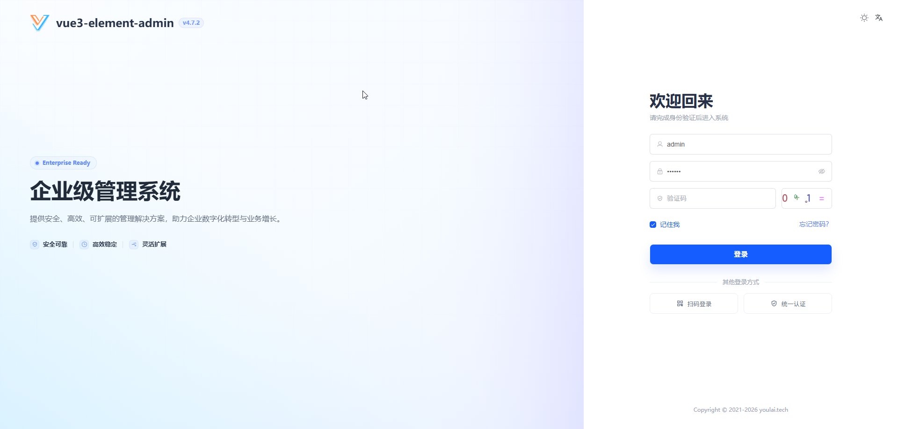
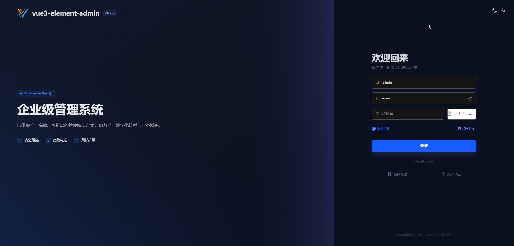
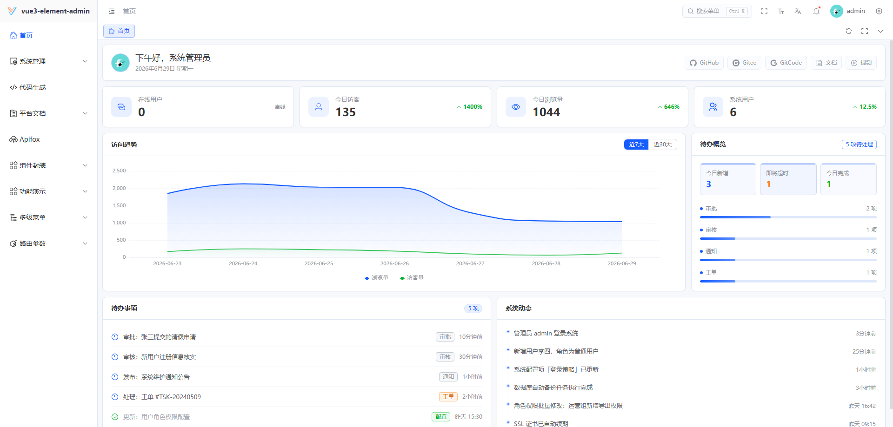
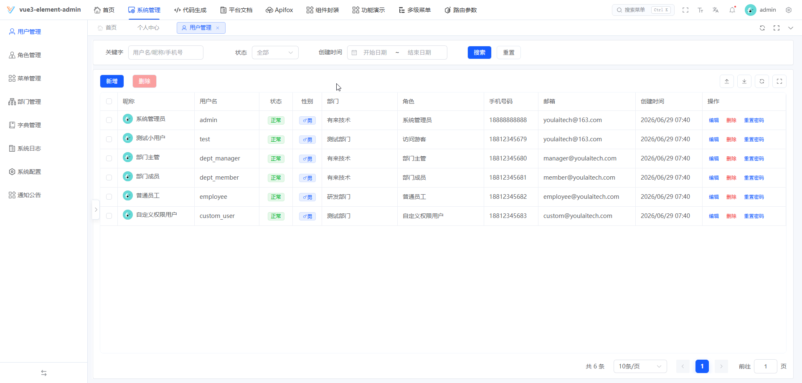
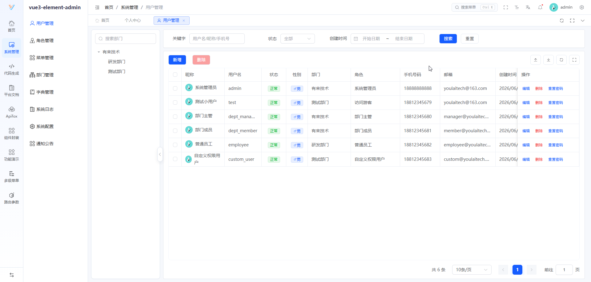
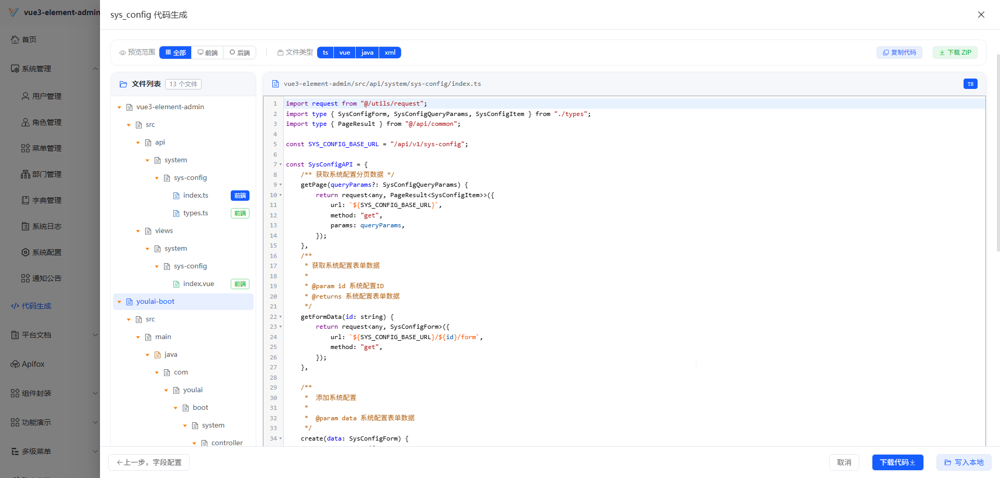

<div align="center">

#  vue3-element-admin

**Vue3 + Vite + TypeScript 企业级中后台前端**

[](https://vuejs.org/)
[](https://element-plus.org/)
[](LICENSE)
[](https://gitee.com/youlaiorg/vue3-element-admin)
[](https://github.com/youlaitech/vue3-element-admin)
[](https://gitcode.com/youlai/vue3-element-admin)
[](https://gitcode.com/youlai/vue3-element-admin)

</div>

<p align="center"></p>

<div align="center">

[](https://vue.youlai.tech)
[](https://app.youlai.tech)
[](https://www.youlai.tech/docs/web/)
[](https://www.youlai.tech/docs/web/)
[](./README.en-US.md)

</div>

## 项目简介

[vue3-element-admin](https://gitcode.com/youlai/vue3-element-admin) 基于 Vue 3、Vite、TypeScript、Element Plus 构建的企业级中后台前端，配套 [9 种主后端 + 衍生版本](#生态矩阵)（覆盖 Java / Node.js / Go / Python / PHP / C# / Rust 7 种语言）及移动端 [youlai-app](https://gitee.com/youlaiorg/youlai-app)。其他前端版本：[JS 版](https://gitee.com/youlaiorg/vue3-element-admin-js) · [精简版](https://gitee.com/youlaiorg/vue3-element-template) · [NaiveUI 版](https://gitee.com/youlaiorg/vue3-naiveui-admin)。

## 项目特色

- **简洁易用** — 基于 [vue-element-admin](https://gitee.com/panjiachen/vue-element-admin) 升级的 Vue3 版本，无过度封装，易上手
- **权限体系** — 动态路由、按钮权限、角色权限和数据权限
- **多租户** — 支持多租户模式与租户隔离
- **基础设施** — 国际化、多布局、暗黑模式、全屏、水印、接口文档、代码生成器
- **数据交互** — 支持 Mock 数据与线上接口文档，配套 Java / Node 后端源码
- **持续更新** — 项目持续开源更新，跟进主流技术栈

## 系统预览

**PC 端**

<table align="center">
  <tr>
    <td></td>
    <td></td>
  </tr>
  <tr>
    <td></td>
    <td></td>
  </tr>
  <tr>
    <td></td>
    <td></td>
  </tr>
</table>

**移动端**

<table align="center">
  <tr>
    <td></td>
    <td></td>
    <td></td>
    <td></td>
  </tr>
</table>

## 快速开始

**环境要求**：Node.js `^20.19.0` 或 `>=22.12.0` · pnpm `>=8.0.0`

| 环境类型 | 版本要求 | 备注 |
| -------- | -------- | ---- |
| **Node.js** | `^20.19.0` 或 `>=22.12.0` | 推荐 LTS 版本（主版本为偶数） |
| **包管理器** | `pnpm >= 8.0.0` | 项目使用 pnpm 作为包管理器 |
| **开发工具** | [Visual Studio Code](https://code.visualstudio.com/Download) | 推荐安装 Vue、TypeScript 相关插件 |

```bash
# 克隆代码
git clone https://gitee.com/youlaiorg/vue3-element-admin.git
cd vue3-element-admin

# 安装 pnpm（已安装可跳过）
npm install pnpm -g

# 设置镜像源（可忽略）
pnpm config set registry https://registry.npmmirror.com

# 安装依赖
pnpm install

# 启动运行
pnpm run dev
```

启动后访问 [http://localhost:3000](http://localhost:3000)，使用 `admin` / `123456` 登录。

> 更多内容详见官方文档：[快速开始](https://www.youlai.tech/docs/web/) · [部署指南](https://www.youlai.tech/docs/web/deployment/deploy.html)

## AI 编程

本项目配套 [Agent Skill](https://skills.sh/youlaitech/youlai-skills)，安装后 AI 编程助手会自动遵循本项目的 Vue3 开发规范（命名、目录结构、BEM + UnoCSS、组件与 API 约定）。支持 CodeBuddy、Claude Code、Cursor、Codex、GitHub Copilot 等 70+ Agent。

```bash
npx skills add https://github.com/youlaitech/youlai-skills --skill vue
```

## 生态矩阵

**前端**

| 项目 | 技术栈 | 说明 | 更新状态 |
|:-----|:-------|:-----|:---------|
| [vue3-element-admin](https://gitee.com/youlaiorg/vue3-element-admin) | Vue 3 + Vite + TS + Element Plus | PC 管理前端（主推） | ✅️ |
| [vue3-element-admin-js](https://gitee.com/youlaiorg/vue3-element-admin-js) | Vue 3 + Vite + JS + Element Plus | JavaScript 版本 | ✅️ |
| [vue3-element-template](https://gitee.com/youlaiorg/vue3-element-template) | Vue 3 + Vite + TS + Element Plus | 精简模板 | ✅️ |
| [vue3-naiveui-admin](https://gitee.com/youlaiorg/vue3-naiveui-admin) | Vue 3 + Vite + TS + Naive UI | Naive UI 版本 | ✅️ |
| [youlai-app](https://gitee.com/youlaiorg/youlai-app) | Vue 3 + UniApp | 移动端 App | ✅️ |

**后端**

| 项目 | 技术栈 | 说明 | 更新状态 |
|:-----|:-------|:-----|:---------|
| [youlai-boot](https://gitee.com/youlaiorg/youlai-boot) | Spring Boot + MyBatis-Plus | Java（主推） | ✅️ |
| [youlai-nest](https://gitee.com/youlaiorg/youlai-nest) | NestJS + TypeORM | Node.js | ✅️ |
| [youlai-gin](https://gitee.com/youlaiorg/youlai-gin) | Go + Gorm | Go | ✅️ |
| [youlai-django](https://gitee.com/youlaiorg/youlai-django) | Django + DRF | Python | ✅️ |
| [youlai-fastapi](https://gitee.com/youlaiorg/youlai-fastapi) | FastAPI + SQLAlchemy | Python | ✅️ |
| [youlai-laravel](https://gitee.com/youlaiorg/youlai-laravel) | Laravel + Eloquent | PHP | ✅️ |
| [youlai-think](https://gitee.com/youlaiorg/youlai-think) | ThinkPHP + ThinkORM | PHP | ✅️ |
| [youlai-aspnet](https://gitee.com/youlaiorg/youlai-aspnet) | ASP.NET Core + EF Core | C# | ✅️ |
| [youlai-axum](https://gitee.com/youlaiorg/youlai-axum) | Axum + SeaORM | Rust | ✅️ |

> 九种后端共享同一套 **RESTful API 规范** 和 **数据库结构**，前端可无缝切换。

**衍生版本**

| 项目 | 基于 | 类型 | 说明 | 更新状态 |
|:-----|:-----|:-----|:-----|:---------|
| [youlai-boot-tenant](https://gitee.com/youlaiorg/youlai-boot-tenant) | youlai-boot | 独立仓库 | 多租户 SaaS，租户隔离与租户配置 | ✅️ |
| [youlai-nest (multi-tenant)](https://gitee.com/youlaiorg/youlai-nest/tree/multi-tenant) | youlai-nest | 分支 | 多租户 SaaS，租户隔离与租户配置 | ✅️ |
| [youlai-boot-flex](https://gitee.com/youlaiorg/youlai-boot-flex) | youlai-boot | 独立仓库 | 改用 MyBatis-Flex | ✅️ |
| [youlai-boot (db-pg)](https://gitee.com/youlaiorg/youlai-boot/tree/db-pg) | youlai-boot | 分支 | PostgreSQL 数据库分支 | ✅️ |
| [youlai-boot (multi-module)](https://gitee.com/youlaiorg/youlai-boot/tree/multi-module) | youlai-boot | 分支 | 多模块工程拆分 | ✅️ |
| [youlai-boot (spring-boot-3)](https://gitee.com/youlaiorg/youlai-boot/tree/spring-boot-3) | youlai-boot | 分支 | Spring Boot 3 兼容分支 | ✅️ |

## 开发指南

| 名称 | 地址 |
| -------- | -------- |
| 视频教程 | [https://www.bilibili.com/video/BV1eFUuYyEFj](https://www.bilibili.com/video/BV1eFUuYyEFj) |
| 项目搭建 | [基于 Vue3 + Vite + TypeScript + Element-Plus 从0到1搭建后台管理系统](https://blog.csdn.net/u013737132/article/details/130191394) |
| 官方文档 | [https://www.youlai.tech/docs/web/](https://www.youlai.tech/docs/web/) |
| 部署指南 | [https://www.youlai.tech/docs/web/deployment/deploy.html](https://www.youlai.tech/docs/web/deployment/deploy.html) |
| 常见问题 | [https://www.youlai.tech/docs/faq/](https://www.youlai.tech/docs/faq/) |
| 代码规范 | [ESLint V9 + Prettier + Stylelint + EditorConfig 约束和统一前端代码规范](https://youlai.blog.csdn.net/article/details/145608723) |
| 提交规范 | [Husky + Lint-staged + Commitlint + Commitizen + cz-git 配置 Git 提交规范](https://youlai.blog.csdn.net/article/details/145615236) |
| 接口文档 | [https://www.apifox.cn](https://www.apifox.cn/apidoc/shared-195e783f-4d85-4235-a038-eec696de4ea5) |

## 项目部署

执行 `pnpm run build` 打包生成 `dist` 目录，上传至服务器并配置 Nginx 反向代理。

```bash
pnpm run build
```

详细部署流程（Nginx 配置、反向代理、HTTPS 等）见 [部署指南](https://www.youlai.tech/docs/web/deployment/deploy.html)。

## 数据接口

前端默认使用线上接口，也可切换为本地 Mock 或对接本地后端。

**本地 Mock**：将 `.env.development` 的 `VITE_MOCK_DEV_SERVER` 设为 `true` 即启用本地 Mock 接口，无需后端即可独立开发。

**对接后端**：九种后端默认端口均为 `8000`，将 `.env.development` 的 `VITE_APP_API_URL` 改为 `http://localhost:8000` 并启动对应后端即可（主推 Java 后端 [youlai-boot](https://gitee.com/youlaiorg/youlai-boot.git)，其余见各自仓库 README）。

## 提交规范

执行 `pnpm run commit` 唤起 git commit 交互，根据提示完成信息的输入和选择。


## 技术合作

本项目采用 [MIT](LICENSE) 协议开源，可免费商用。欢迎在 [Issue](https://gitee.com/youlaiorg/vue3-element-admin/issues) 提交问题或反馈，也欢迎提交 [Pull Request](https://gitee.com/youlaiorg/vue3-element-admin/pulls) 共建。如需技术支持、商务合作、二次开发或项目定制，可联系作者微信（见下方二维码）。

<table align="center">
  <tr>
    <td align="center">
      <br>
      <sub>公众号「有来技术」</sub>
    </td>
    <td>&nbsp;&nbsp;&nbsp;&nbsp;</td>
    <td align="center">
      <br>
      <sub>小程序「有来技术」</sub>
    </td>
    <td>&nbsp;&nbsp;&nbsp;&nbsp;</td>
    <td align="center">
      <br>
      <sub>添加作者微信</sub>
    </td>
  </tr>
</table>

<p align="center"><em>技术交流 · 问题反馈 · 商务合作</em></p>

