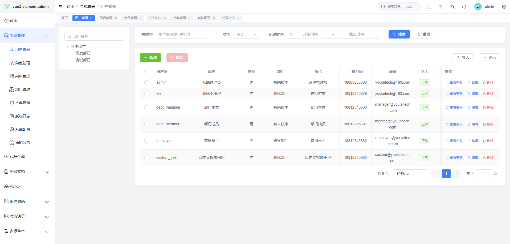
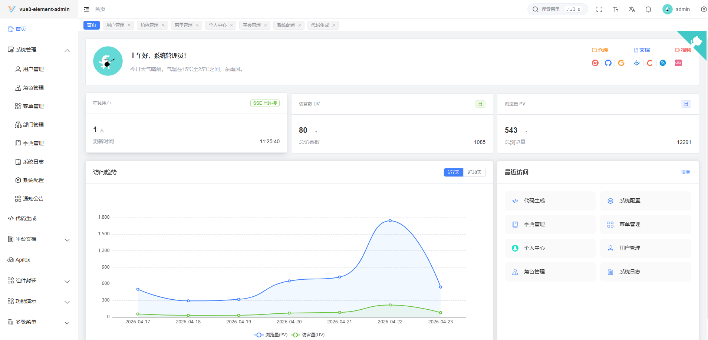
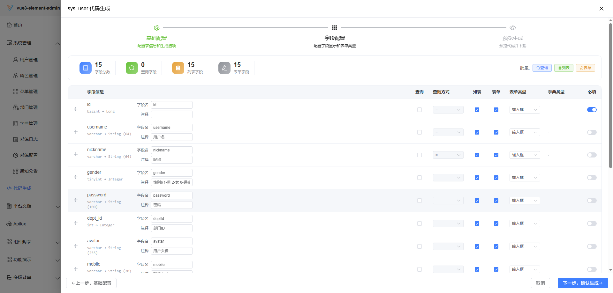
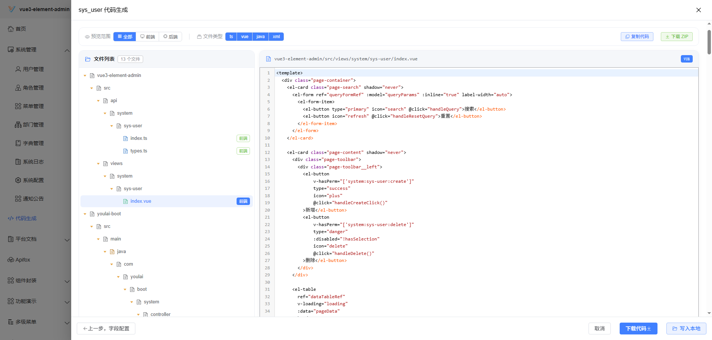
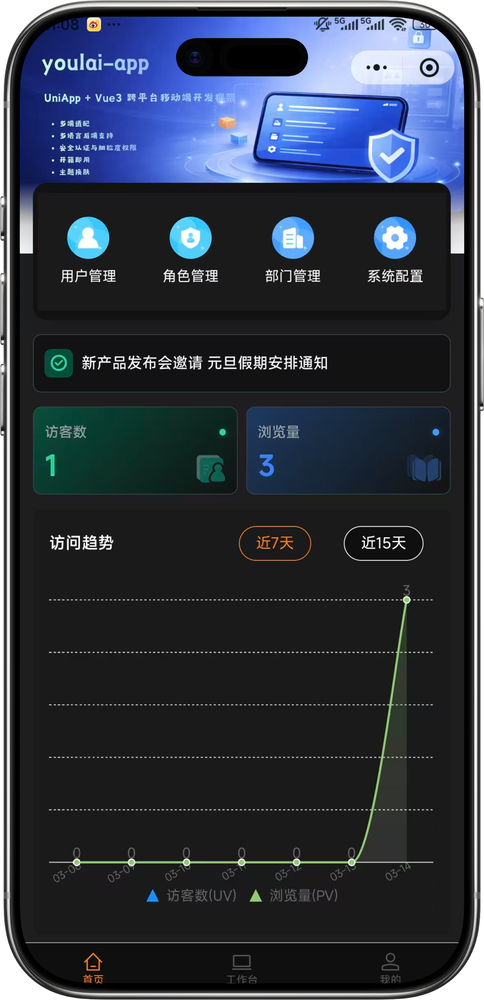
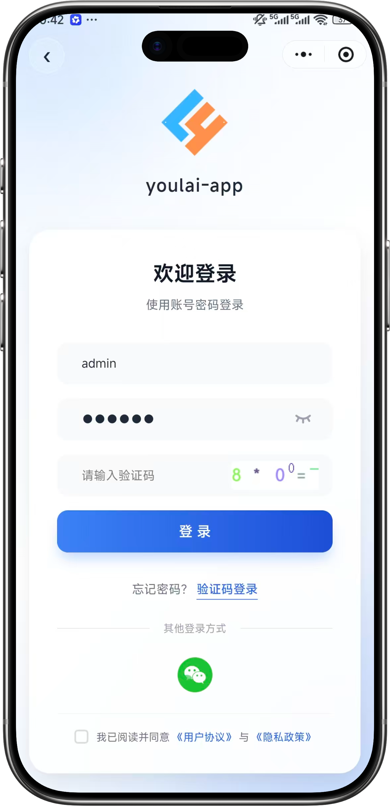

<div align="center">


# vue3-element-admin

**Vue3 + Vite + TypeScript 企业级后台管理前端**

[](https://vuejs.org/)
[](https://element-plus.org/)
[](https://gitee.com/youlaiorg/vue3-element-admin/stargazers)
[](https://github.com/youlaitech/vue3-element-admin)
[](https://gitcode.com/youlai/vue3-element-admin/stargazers)
[](LICENSE)

</div>


<div align="center">
  <a target="_blank" href="https://vue.youlai.tech">🖥️ 在线预览</a> | <a target="_blank" href="https://app.youlai.tech">📲 移动端预览</a> |  <a target="_blank" href="https://juejin.cn/post/7228990409909108793">📑 阅读文档</a>|  <a target="_blank" href="https://www.youlai.tech/docs/web/">🌐 官网</a> | <a href="./README.en-US.md">💬 English
</div>

## 项目简介

[vue3-element-admin](https://gitcode.com/youlai/vue3-element-admin) 基于 Vue3、Vite、TypeScript 和 Element-Plus 搭建的极简开箱即用企业级后台管理前端模板。 配套 Java 后端 [youlai-boot](https://gitee.com/youlaiorg/youlai-boot)、多租户后端 [youlai-boot-tenant](https://gitee.com/youlaiorg/youlai-boot-tenant) 和 Node 后端 [youlai-nest](https://gitee.com/youlaiorg/youlai-nest) 。 提供开发简版[vue3-element-template](https://gitee.com/youlaiorg/vue3-element-template) 和 JS 版本[vue3-element-admin-js](https://gitee.com/youlaiorg/vue3-element-admin) 供开发者快速开发。

## 项目特色

- **简洁易用**：基于 [vue-element-admin](https://gitee.com/panjiachen/vue-element-admin) 升级的 Vue3 版本，无过渡封装 ，易上手。
- **数据交互**： 支持 `Mock` 数据和[线上接口文档](https://www.apifox.cn/apidoc/shared-195e783f-4d85-4235-a038-eec696de4ea5)，并提供配套的 [Java](https://gitee.com/youlaiorg/youlai-boot) 和 [Node](https://gitee.com/youlaiorg/youlai-nest) 后端源码。

- **系统功能：** 提供用户管理、角色管理、菜单管理、部门管理、字典管理、系统配置、通知公告等功能模块。
- **权限管理：** 支持动态路由、按钮权限、角色权限和数据权限等多种权限管理方式。

- **多租户：** 支持多租户模式与租户隔离。

- **基础设施：** 提供国际化、多布局、暗黑模式、全屏、水印、接口文档和代码生成器等功能。
- **持续更新**：项目持续开源更新，实时更新工具和依赖。

## 系统预览

**PC 端**

<table align="center">
  <tr>
    <td></td>
    <td></td>
  </tr>
  <tr>
    <td></td>
    <td></td>
  </tr>
  <tr>
    <td></td>
    <td></td>
  </tr>
</table>

**移动端**

<table align="center">
  <tr>
    <td></td>
    <td></td>
    <td></td>
    <td></td>
  </tr>
</table>

## 生态矩阵

**前端**

| 项目 | 技术栈 | 说明 |
|:-----|:-------|:-----|
| [vue3-element-admin](https://gitee.com/youlaiorg/vue3-element-admin) | Vue 3 + Vite + TS + Element Plus | PC 管理前端（主推） |
| [vue3-element-admin-js](https://gitee.com/youlaiorg/vue3-element-admin-js) | Vue 3 + Vite + JS + Element Plus | JavaScript 版本 |
| [vue3-element-template](https://gitee.com/youlaiorg/vue3-element-template) | Vue 3 + Vite + TS + Element Plus | 精简模板 |
| [youlai-app](https://gitee.com/youlaiorg/youlai-app) | Vue 3 + UniApp | 移动端 App |

**后端**

| 项目 | 技术栈 | 说明 |
|:-----|:-------|:-----|
| [youlai-boot](https://gitee.com/youlaiorg/youlai-boot) | Spring Boot + MyBatis-Plus | Java 后端（主推） |
| [youlai-nest](https://gitee.com/youlaiorg/youlai-nest) | NestJS + TypeORM | Node.js |
| [youlai-gin](https://gitee.com/youlaiorg/youlai-gin) | Go + Gorm | Go |
| [youlai-django](https://gitee.com/youlaiorg/youlai-django) | Django + DRF | Python |
| [youlai-think](https://gitee.com/youlaiorg/youlai-think) | ThinkPHP 8 | PHP |
| [youlai-aspnet](https://gitee.com/youlaiorg/youlai-aspnet) | ASP.NET Core | C# |

> **youlai-boot** 还提供以下变种和分支版本：[多租户](https://gitee.com/youlaiorg/youlai-boot-tenant)（Spring Boot 4）· [MyBatis-Flex](https://gitee.com/youlaiorg/youlai-boot-flex)（Spring Boot 4）· [Spring Boot 3](https://gitee.com/youlaiorg/youlai-boot/tree/spring-boot-3) · [PostgreSQL](https://gitee.com/youlaiorg/youlai-boot/tree/db-pg) · [多模块](https://gitee.com/youlaiorg/youlai-boot/tree/multi-module)
>
> 六种后端共享同一套 **RESTful API 规范** 和 **数据库结构**，前端可无缝切换。

## 开发指南

| 名称     | 地址                                                                                                                               |
| -------- | ---------------------------------------------------------------------------------------------------------------------------------- |
| 视频教程 | [https://www.bilibili.com/video/BV1eFUuYyEFj](https://www.bilibili.com/video/BV1eFUuYyEFj)                                         |
| 项目搭建 | [基于 Vue3 + Vite + TypeScript + Element-Plus 从0到1搭建后台管理系统](https://blog.csdn.net/u013737132/article/details/130191394)  |
| 官方文档 | [https://www.youlai.tech/docs/web/](https://www.youlai.tech/docs/web/)                                          |
| 代码规范 | [ESLint V9 + Prettier + Stylelint + EditorConfig 约束和统一前端代码规范](https://youlai.blog.csdn.net/article/details/145608723)   |
| 提交规范 | [Husky + Lint-staged + Commitlint + Commitizen + cz-git 配置 Git 提交规范](https://youlai.blog.csdn.net/article/details/145615236) |
| 接口文档 | [https://www.apifox.cn](https://www.apifox.cn/apidoc/shared-195e783f-4d85-4235-a038-eec696de4ea5)                                  |

## 项目启动

- **环境准备**

| 环境类型     | 版本要求                                                     | 备注                              |
| ------------ | ------------------------------------------------------------ | --------------------------------- |
| **Node.js**  | `^20.19.0` 或 `>=22.12.0`                                    | 推荐使用 LTS 版本（主版本为偶数） |
| **包管理器** | `pnpm >= 8.0.0`                                              | 项目使用 pnpm 作为包管理器        |
| **开发工具** | [Visual Studio Code](https://code.visualstudio.com/Download) | 推荐安装 Vue、TypeScript 相关插件 |

- **快速开始**

```bash
# 克隆代码
git clone https://gitee.com/youlaiorg/vue3-element-admin.git

# 切换目录
cd vue3-element-admin

# 安装 pnpm
npm install pnpm -g

# 设置镜像源(可忽略)
pnpm config set registry https://registry.npmmirror.com

# 安装依赖
pnpm install

# 启动运行
pnpm run dev
```

## 项目部署

执行 `pnpm run build` 命令后，项目将被打包并生成 `dist` 目录。接下来，将 `dist` 目录下的文件上传到服务器 `/usr/share/nginx/html` 目录下，并配置 Nginx 进行反向代理。

```bash
pnpm run build
```

以下是 Nginx 的配置示例：

```nginx
server {
    listen      80;
    server_name localhost;

    location / {
        root   /usr/share/nginx/html;
        index  index.html index.htm;
    }

    # 反向代理配置
    location /prod-api/ {
        # 请将 api.youlai.tech 替换为您的后端 API 地址，并注意保留后面的斜杠 /
        proxy_pass http://api.youlai.tech/;
    }
}
```

更多详细信息，请参考这篇文章：[Nginx 安装和配置](https://blog.csdn.net/u013737132/article/details/145667694)。

## 本地Mock

项目同时支持在线和本地 Mock 接口，默认使用线上接口，如需替换为 Mock 接口，修改文件 `.env.development` 的 `VITE_MOCK_DEV_SERVER` 为 `true` **即可**。

## 后端接口

> 如果您具备Java开发基础，按照以下步骤将在线接口转为本地后端接口，创建企业级前后端分离开发环境，助您走向全栈之路。

1. 获取基于 `Java` 和 `SpringBoot` 开发的后端 [youlai-boot](https://gitee.com/youlaiorg/youlai-boot.git) 源码。
2. 根据后端工程的说明文档 [README.md](https://gitee.com/youlaiorg/youlai-boot#%E9%A1%B9%E7%9B%AE%E8%BF%90%E8%A1%8C) 完成本地启动。
3. 修改 `.env.development` 文件中的 `VITE_APP_API_URL` 的值，将其从 https://api.youlai.tech 更改为 http://localhost:8000 即可。

## 注意事项

- **自动导入插件自动生成默认关闭**

  模板项目的组件类型声明已自动生成。如果添加和使用新的组件，请按照图示方法开启自动生成。在自动生成完成后，记得将其设置为 `false`，避免重复执行引发冲突。

  

- **项目启动浏览器访问空白**

  请升级浏览器尝试，低版本浏览器内核可能不支持某些新的 JavaScript 语法，比如可选链操作符 `?.`。

- **项目同步仓库更新升级**

  项目同步仓库更新升级之后，建议 `pnpm install` 安装更新依赖之后启动 。

- **项目组件、函数和引用爆红**

  重启 VSCode 尝试

- **其他问题**

  如果有其他问题或者建议，建议 [ISSUE](https://gitee.com/youlaiorg/vue3-element-admin/issues/new)

## 提交规范

执行 `pnpm run commit` 唤起 git commit 交互，根据提示完成信息的输入和选择。


## 项目统计


Thanks to all the contributors!
感谢所有的贡献者！

[](https://github.com/youlaitech/vue3-element-admin/graphs/contributors)

---

<table align="center">
  <tr>
    <td align="center">
      <br>
      <sub>公众号「有来技术」</sub>
    </td>
    <td>&nbsp;&nbsp;&nbsp;&nbsp;</td>
    <td align="center">
      <br>
      <sub>小程序「有来技术」</sub>
    </td>
    <td>&nbsp;&nbsp;&nbsp;&nbsp;</td>
    <td align="center">
      <br>
      <sub>添加作者微信</sub>
    </td>
  </tr>
</table>

<p align="center"><em>技术交流 · 问题反馈 · 商务合作</em></p>
